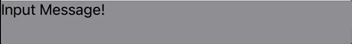

# swiftui-textView

### Requirements
* iOS 14.0+
* Xcode 12.0+
* Swift 5.3


### Content
* [Documentation](#documentation)
* [Modifier](#modifier)
  * [Style](#style)
    * [Appearance](#appearance)
    * [Limit](#limit)
      * [TextCount](#textcountlimit)
      * [TextLine](#textlintlimit)
    * [InputBreak](#inputbreak)
    * [Trim](#trim) 
  * [PlaceHolder](#placeholder)
  * [Configuration](#configuration)
  * [Delegate](#delegate)
  * [ReassembleMode](#reassembleMode)
  * [ReceiveTextViewHeight](#receiveTextViewHeight)
  * [ReceiveTextCount](#receiveTextCount)

<a name="documentation"></a>
# Documentation

SwiftUI에서도 TextView를 대체한 TextEditor라는 View가 존재하지만, 이 기능은 실질적으로 UIKit의 TextView를 대체하기엔 너무 부족합니다.   
그래서 이러한 불편함을 해결하기 위해 만든 swiftui-textView를 소개합니다!

기본적으로 UITextView에서 지원하는 속성이나 UITextViewDelegate을 modifier로 지원하고 있습니다.   

##### Usage examples:
```swift
TextView(text: $text)
    .backgroundColor(color: .gray.opacity(0.5))
    .textContainerInset(.zero)
    .lineFragmentPadding(.zero)
    .setContentCompressionResistancePriority(.defaultLow, for: .horizontal)
    .isScrollEnabled(true)
    .isEditable(true)
    .isSelectable(true)
    .showsVerticalScrollIndicator(false)
    .textViewDidChange { textView in
         print(textView.text)
     }
```


<a name="modifier"></a>
# Modifier

아래부터 소개하는 Modifier들은 같이 사용하면 좋은 기능들을 구현해놨습니다.

<br>

<a name="style"></a>
## Style


<a name="appearance"></a>
### Appearance
* `func setTextViewAppearanceModel(_ config: TextViewAppearanceModel = .default) -> TextView`   
  TextView의 keyboard focus / noneFocus일 때 font하고 textColor를 설정합니다.   

  ##### Usage examples:
  ```swift
  TextView(text: $text)
      .setTextViewAppearanceModel(TextViewAppearanceModel(noneFocus: TextAppearance(font: .boldSystemFont(ofSize: 15),
                                                                                    color: .orange),
                                                          focus: TextAppearance(font: .boldSystemFont(ofSize: 15),
                                                          color: .blue)))
  ```
  <br>

* `func setFocusAppearance(_ config: TextAppearance = .focus) -> TextView`   
  TextView의 focus의 font하고 textColor를 설정합니다.   

  ##### Usage examples:
  ```swift
  TextView(text: $text)
      .setFocusAppearance(TextAppearance(font: .boldSystemFont(ofSize: 15),
                                         color: .blue))
  ```
  <br>
  
* `func setNoneFocusAppearance(_ config: TextAppearance = .noneFocus) -> TextView`   
  TextView의 noneFocus의 font하고 textColor를 설정합니다.   
  
  ##### Usage examples:
  ```swift
  TextView(text: $text)
      .setNoneFocusAppearance(TextAppearance(font: .boldSystemFont(ofSize: 15),
                                             color: .orange))
  ```

  <br>

  
<a name="limit"></a>
### Limit

<a name="textcountlimit"></a>
* `func limitCount(_ count: Int) -> TextView`   
  TextView의 textCount를 제한합니다.   
  default값은 999,999입니다.

    ##### Usage examples:
  ```swift
  TextView(text: $text)
      .limitCount(100)
  ```
  <br>
  
<a name="textlintlimit"></a>
* `func limitLine(_ line: Int) -> TextView`   
  TextView의 line을 제한합니다.   
  default값은 999,999입니다.

    ##### Usage examples:
  ```swift
  TextView(text: $text)
      .limitLine(5)
  ```
  <br>
  

* `func limitCountAndLine(_ count: Int, _ line: Int) -> TextView`    
  TextView의 textCount와 line을 제한합니다.   
  default값은 둘 다 999,999입니다.

  ##### Usage examples:
  ```swift
  TextView(text: $text)
      .limitCountAndLine(100, 5)
  ```
  <br>

<a name="inputbreak"></a>
### InputBreak

* `func inputBreakMode(_ mode: TextViewInputBreakMode = .none) -> TextView`   
  TextView의 입력을 TextViewInputBreakMode에 따라 막습니다.   
  이 modifier는 controlTextViewDelegate에서 설정한 TextViewDelegateMode가 automatic일 때 작동합니다.

  | mode | description |
  |:--:|:--:|
  | `none` | default |
  | `lineBreak` | 개행의 입력을 막는다. |
  | `whiteSpace` | 공백의 입력을 막는다. |
  | `continuousWhiteSpace` | 연속된 공백의 입력을 막는다. |
  | `lineWithWhiteSpace` | 개행과 공백의 입력을 막는다. |
  | `lineWithContinuousWhiteSpace` | 개행과 연속된 공백의 입력을 막는다. |


<a name="trim"></a>
### Trim

* `func trimMode(_ method: TextViewTrimMode = .whitespaces) -> TextView`   
  TextView의 text에 있는 공백이나 개행을 제거합니다.   
  이 modifier는 controlTextViewDelegate에서 설정한 TextViewDelegateMode가 automatic일 때 작동합니다.

  | mode | description |
  |:--:|:--:|
  | `none` | default |
  | `whitespaces` | trimmingCharacters의 whitespaces와 같습니다. |
  | `whitespacesAndNewlines` | trimmingCharacters의 whitespacesAndNewlines와 같습니다. |
  | `blankWithWhitespaces` | 문자열 사이의 공백과 whitespaces를 제거합니다. |
  | `blankWithWhitespacesAndNewlines` | 문자열 사이의 공백과 blankWithWhitespacesAndNewlines를 제거합니다. |
  
  

<a name="placeholder"></a>
## PlaceHolder

* `@ViewBuilder
  func overlayPlaceHolder<V>(_ alignment: Alignment = .center, @ViewBuilder content: @escaping () -> V) -> some View where V: View`   
  TextView에 PlaceHolder를 세팅합니다.   
  alignment옵션으로 content의 alignment를 설정할 수 있습니다.   
  text의 count가 0이하일 경우에만 content가 노출 되고, 아닐 경우에는 EmptyView()를 리턴합니다.

  ##### Usage examples:
  ```swift
  TextView(text: $text)
      .changeBackgroundColor(.gray)
      .overlayPlaceHolder(.topLeading) {
          Text("Input Message!")
      }
      .frame(height: 50)
  ```

  


<a name="configuration"></a>
## Configuration

* `func textViewConfiguration(_ configuration: @escaping (UITextView) -> Void) -> TextView`   
  TextView의 옵션을 세팅합니다.   
  configuration의 UITextView에 원하는 옵션들을 설정하면, makeUIView에서 해당 옵션들을 세팅합니다.   
  다른 modifier로 옵션들을 설정하는걸 원치 않을 경우에, 해당 modifier를 사용해서 TextView를 구현하면 됩니다.

  ##### Usage examples:
  ```swift
  TextView(text: $text)
      .textViewConfiguration { textView in
          textView.backgroundColor = .gray
          textView.textContainerInset = .zero
          textView.textContainer.lineFragmentPadding = .zero
          textView.setContentCompressionResistancePriority(.defaultLow, for: .horizontal)
      }
  ```


<a name="delegate"></a>
## Delegate

* `func controlTextViewDelegate(_ mode: TextViewDelegateMode = .automatic) -> TextView`   
  TextView의 delegate를 설정합니다.   
  TextViewDelegateMode의 옵션에 따라 UITextViewDelegate를 처리하는 방식을 정합니다.

  | mode | description |
  |:--:|:--:|
  | `none` | configuration을 이용해서 Delegate 처리 |
  | `modifier` | modifier로 구현된 것 받아서 처리 |
  | `automatic` | 시스템 방식대로 처리 |


  ##### Usage examples:
  ```swift
  /// TextViewDelegateMode : none
  public var coordinator = Coordinator()
  
  TextView(text: $text)
      .textViewConfiguration { textView in
          textView.delegate = coordinator
       }
      .controlTextViewDelegate(.none)
  ```

  ##### Usage examples:
  ```swift

  /// TextViewDelegateMode : modifier
  TextView(text: $text)
      .controlTextViewDelegate(.modifier)
      .textViewDidBeginEditing { textView in
          print(textView)
      }
      .textViewDidChange { textView in
          print(textView)
      }
      .textViewDidEndEditing { textView in
          print(textView)
      }
  ```

  ##### Usage examples:
  ```swift
  /// TextViewDelegateMode : automatic
  TextView(text: $text)
      .controlTextViewDelegate(.automatic)
  ```


<a name="receiveTextViewHeight"></a>
## ReceiveTextViewHeight

* `func receiveTextViewHeight(_ height: @escaping ((CGFloat) -> Void)) -> TextView`   
  TextView의 height을 알려주는 Modifier입니다.


  ##### Usage examples:
  ```swift
  TextView(text: $text)
      .receiveTextViewHeight { height in
          textViewHeight = height
      }
  ```


<a name="receiveTextCount"></a>
## ReceiveTextCount

* `func receiveTextCount(_ count: @escaping ((Int) -> Void)) -> TextView`   
  TextView의 text count를 알려주는 Modifier입니다.
  해당 Modifier는 trimMode에 영향을 받습니다.

  ##### Usage examples:
  ```swift
  TextView(text: $text)
      .receiveTextCount { count in
          textCount = count
      }
  ```

  

<a name="reassembleMode"></a>
## ReassembleMode

* `func reassembleMode(_ mode: Bool = false) -> TextView`   
  TextView를 구현할 때 설정한 @State의 text를 키보드 입력이 아닌 방식으로 수정을 할 때, UITextView의 text에 업데이트 할지 말지를 정하는 기능입니다.
  
  키보드 입력 없이 TextView의 text를 변경하고 싶으나 id를 부여해서 초기화 하는 방법을 원치 않을 경우에 reassembleMode를 사용하면 됩니다.
  
  기존 `UITextView`의 text하고 `@Binding` text가 달라진 `range`랑 `replacementText`를 뽑아 내고 `replacementText`가 `inputBreakMode`에 의해 통과되는지 검사를 합니다.   
  그 다음, `limitLine`, `limitCount`, `inputBreakMode`, `trimMode`에 의해 reassemble된 text를 가지고 UITextView에 업데이트 결정합니다.   
  
  그 후, 맨 마지막으로 @Binding text가 UITextView의 text하고 다른 경우에 @Binding text를 UITextView text로 변경합니다.

  ##### Usage examples:
  ```swift
  TextView(text: $text)
      .reassembleMode(true)
  ```


  <br>
  <br>
  <br>

